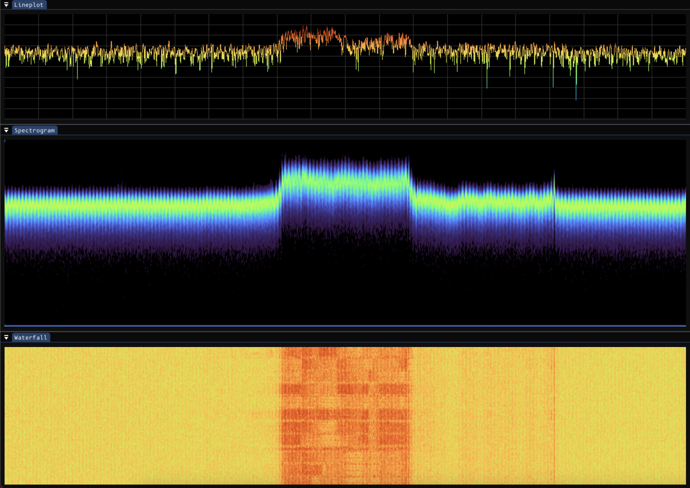

# 📡 gr-teleskop

### Read Allen Telescope Array (ATA) recordings in GNU Radio!

<p align="center">

</p>

## Installation

#### Python
```
$ python -m pip install git+https://github.com/wfarah/guppi.git@cf16
```

#### C++
```
$ git clone https://github.com/luigifcruz/gr-teleskop.git
$ cd gr-teleskop
$ mkdir build
$ cd build
$ cmake ..
$ make -j
$ make install
```
